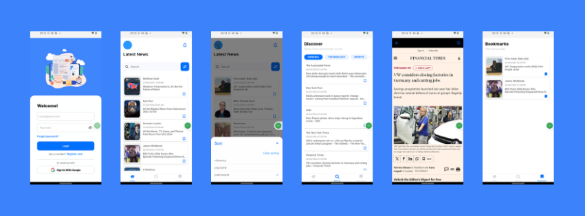

# Global News React Native Application

A mini mobile application using the Global News API to fetch and display news articles. This project is intended for showcasing skills in mobile development, UI/UX design, and React Native with Android native methodologies.

## Installation and Setup

1. **Clone the repository:**
   ```bash
   git clone https://github.com/limiRatnayake/GlobalNewsApp.git
   cd GlobalNewsApp

2. **Install dependencies using Yarn:**
   ```bash
   yarn install

3. **Connect your device or emulator:**
   Ensure that your Android device is connected or your emulator is running.
   ```bash 
   adb devices

4. **Run the application:**
  ```bash 
  adb reverse tcp:8081 tcp:8081
yarn start 
```

## Download App (APK) 

[**Download Global News App…**](https://github.com/limiRatnayake/GlobalNewsApp/releases/tag/v1.0.0)


## Features

- **Splash Screen:** An attractive splash screen that appears when the application is launched.
- **User Authentication:**
  - **Normal Login:** Basic login system using email and password.
  - **Google Login:** Login using Google authentication.
  - **Register:** Provides functionality for new users to create an account.
- **News Searching:** Search for news articles using keywords.
- **Sorting:** Options to sort news articles by popularity, relevance, publishedAt.
- **News Categories:** Display news articles based on categories such as Technology, Sports, and Business.
- **Bookmarking:** Users can bookmark their favorite articles for easy access.
- **Push Notifications:** Users receive notifications about new and important news articles.
- **Offline Access:** Enhance the app by enabling it to cache news articles, allowing users to access and read them even when they are offline.

## Screens

1. **Splash Screen:** Displayed on app launch.
2. **Login Screen:** Allows user login with email/password or Google account.
3. **Register Screen:** Allows user to register with email, password.
4. **Home Screen:** Displays the latest news articles.
5. **Search Component:** Users can search for news articles.
6. **Category Screen:** Displays articles filtered by category.
7. **Article Detail Screen:** Displays the full content of a selected news article & when offline show unformatted content of the article.
8. **Bookmarks Screen:** Lists all bookmarked articles.
9. **Notification Screen:** Lists all notification received.
10. **Profile Screen:** User can change there info.

## Technical Stack

- **Framework:** React Native
- **State Management:** Redux Toolkit
- **Navigation:** React Navigation
- **API:** Axios for networking with the Global News API
- **Authentication:** Firebase Authentication for email/password and Google Sign-In 
- **Database:** Firebase Cloud Firestore & SQLite
- **Notification:** Firebase Messaging & React Native Push Notifications
- **Offline Suport:** storing structured data locally on the device, providing fast access to large amounts of data, and managing offline capabilities efficiently
 
## Other libraries 
- **crypto-js:** library to generate unique ID values
- **react-native-bootsplash:** library to create splash screen
- **react-native-push-notification:** manage and deliver push notifications seamlessly
- **react-native-webview:** Used to load and display articles within the app

## Architecture

- **Pattern:** MVVM (Model-View-ViewModel)
- **State Management:** Redux for state management

## Native Integration

- **Note:** Android native methodologies (e.g., Fragments) were planned but are not implemented in this version. Future updates may include these features.


## Screenshots

 


